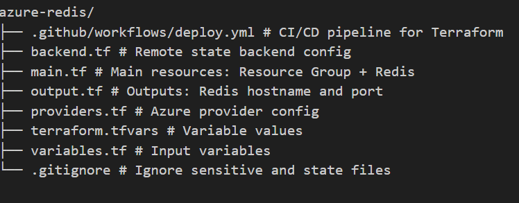

##  Azure Cache for Redis Deployment with Terraform

This repository contains Terraform code to provision an **Azure Cache for Redis** instance using best practices including:
- Remote backend (Azure Storage Account)
- GitHub Actions CI/CD deployment
- Parameterization via `terraform.tfvars`

---

##  Project Structure 




---

##  Required Secrets in GitHub

In your GitHub repo, go to **Settings → Secrets and Variables → Actions** and add:

AZURE_CREDENTIALS  and the value is in Json format

```
{
  "clientId": "xxxxxxxx-xxxx-xxxx-xxxx-xxxxxxxxxxxx",
  "clientSecret": "your-very-secure-client-secret",
  "tenantId": "yyyyyyyy-yyyy-yyyy-yyyy-yyyyyyyyyyyy",
  "subscriptionId": "zzzzzzzz-zzzz-zzzz-zzzz-zzzzzzzzzzzz"
}
```

These are required for the GitHub Actions workflow to authenticate with Azure.
How you get these : in shell run the command :
# az ad sp create-for-rbac --name "<App registration name(Service Principal)>" --role Contributor --scopes /subscriptions/$(az account show --query id -o tsv) --sdk-auth

The GitHub workflow uses OIDC for secure login — no client-secret required.

# Workflow
Every push to main triggers:

Terraform init, validate, plan, apply

Auto-approve is enabled for demo purposes

You can find the workflow in .github/workflows/deploy.yml.

# Outputs
redis_host_name – The Redis hostname

redis_ssl_port – SSL port to connect securely

##  Cleanup
```terminal
terraform init
terraform destroy 
```

# References
Azure Cache for Redis - Terraform Docs

https://registry.terraform.io/providers/hashicorp/azurerm/latest/docs/resources/redis_cache#Microsoft.Cache-1
